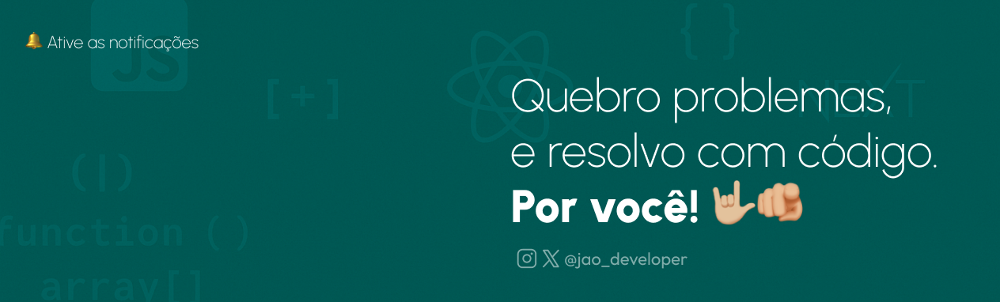

# 👋🏼 E aí, eu sou o Jão!

  

---

## 🚦 Open to Work
**Estágio | Freelance | Colaborações**

---

## 🚀 Sobre mim
- 🌱 Atualmente estudando: **Full Stack — JavaScript | TypeScript | React | Next | Node | Prisma | PostgreSQL**
- 💡 Apaixonado por tecnologia, resolver problemas e transformar ideias em soluções reais
- 🎯 Buscando me aprimorar como dev
- 💻 Empreendendo, codando e aprendendo todos os dias
- 🔥 Meu ikigai é: usar código pra facilitar a vida das pessoas

---

## 🏆 Projetos em Destaque
| Projeto | Descrição | Tecnologias | Status | Link |
|---------|-----------|--------------|------|
| **TôLivre** | Plataforma de agendamento, lembretes e cobrança para autônomos | Next.js, Node.js, Prisma, PostgreSQL | Em desenvolvimento | [Acesse aqui](to-livre.vercel.app) |
| **Cash Flow** | Cash Flow é um sistema de gestão financeira simples e intuitivo | React, Chakra UI, React Rewards | Em desenvolvimento | [Acesse aqui](https://cash-flow-dusky.vercel.app/) |
| **Landing Pages Profissionais** | Desenvolvimento de páginas para negócios locais | Next.js, Tailwind CSS | Sob demanda |[Acesse aqui](to-livre.vercel.app) |

---

## 🛠️ Tecnologias e Ferramentas

---

## 📈 GitHub Stats

  
  

---

## 🚀 Onde me encontrar

---

